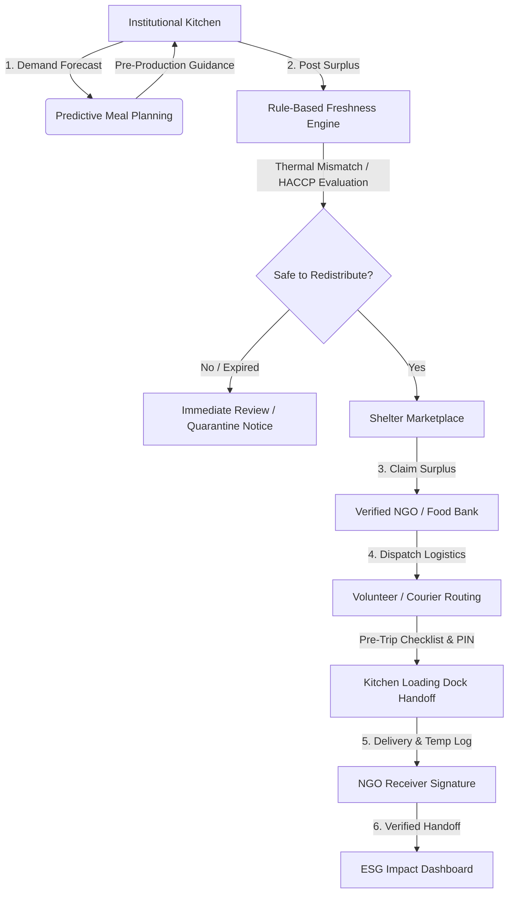

# 🍲 NourishRelief

> **Smart India Hackathon 2026**  
> **Theme:** Agriculture and Food Tech  
> **Problem Statement:** “AI-Powered Smart Food Waste Reduction and Sustainable Redistribution Ecosystem for Institutional Kitchens and Food Processing Units”

[](https://nextjs.org/)
[](https://www.typescriptlang.org/)
[](https://tailwindcss.com/)
[](https://playwright.dev/)
[](https://www.fda.gov/food/hazard-analysis-critical-control-point-haccp)

---

## 📌 Executive Summary

**NourishRelief** is an enterprise-grade food waste reduction and perishable food redistribution platform engineered for institutional kitchens, universities, hospital canteens, corporate cafeterias, and food processing units. 

Unlike conventional food donation apps that only react after food has spoiled, NourishRelief operates across the entire food lifecycle:
1. **Predictive Demand & Surplus Forecasting**: Predicts meal consumption and potential surplus before cooking begins using uncertainty ranges and contextual factors (festivals, weather, holidays).
2. **HACCP-Aligned Freshness & Expiry Risk Assessment**: A rule-based safety engine evaluates preparation timestamps, elapsed holding duration, holding conditions, and recorded probe temperatures with strict thermal mismatch safeguards.
3. **Automated NGO Matching & Claiming**: Connects food donors with verified recipient shelters and community kitchens based on real-time portion requirements and dietary preferences.
4. **Cold-Chain Logistics & Verification**: Guided volunteer routing with pre-flight safety checklists, digital handoff PINs, handoff temperature logging, and electronic signatures.
5. **ESG Impact & Sustainability Analytics**: Live tracking of meals rescued, food waste diverted (kg), and CO₂ emissions prevented.

---

## 🚀 Lifecycle Workflow Architecture



---

## 🌟 Core Features & Modules

### 1. 📊 Demand & Surplus Forecasting (`/forecast`)
- **Range-Based Uncertainty Forecasting**: Generates Min, Most Likely, and Max meal demand projections rather than misleading point estimates.
- **Contextual Adjustment Factors**: Adjusts meal targets based on real-time parameters:
  - Festival calendar modifiers
  - Public holidays & campus schedules
  - Inclement weather impacts
  - Historical attendance trends
- **Actionable Kitchen Directives**: Provides direct batch reduction recommendations before kitchen staff start cooking.

### 2. 🧪 Rule-Based Freshness & Expiry Risk Assessment (`/restaurant/post`)
- **HACCP Guidelines Integration**: Evaluates Hazard Analysis Critical Control Point thresholds across standard commercial food holding categories:
  - **Hot Holding**: Target $>60^\circ\text{C}$
  - **Chilled Holding**: Target $0 - 4^\circ\text{C}$
  - **Ambient / Room Temp**: Target $\le 25^\circ\text{C}$
- **Thermal Mismatch Protection**: Catches dangerous mismatches (e.g. food marked as Chilled but probing at $64^\circ\text{C}$, or Hot food dropped to room temperature). Automatically collapses the redistribution window and alerts staff for immediate inspection.
- **Dynamic Redistribution Priority**: Labels batches as `NORMAL`, `PRIORITY`, or `URGENT` with accurate remaining safe shelf-life calculations.
- **Post-Expiry Safe Handling**: Displays unambiguous guidance (`Redistribution window has expired. Immediate review is recommended before redistribution.`) when thresholds are crossed.

### 3. 🤝 Verified NGO Claiming Hub (`/ngo/claim`)
- **Real-Time Surplus Listings**: Browse active surplus batches with dietary tags (Vegetarian, Halal, Nut-Free), portion sizes, packaging notes, and donor ratings.
- **Demand Matching**: Match batches directly against registered shelter capacity and clients awaiting meals.
- **Safety Compliance Certification**: Enforces digital certification acknowledgement prior to claim authorization.

### 4. 🚴 Courier Logistics & Routing (`/volunteer/pickup`)
- **Pre-Trip Safety Checklist**: Mandatory verification of thermal delivery bags, sanitized crates, and calibrated probe thermometers.
- **Secure Loading Dock Handoff**: PIN-verified custody transfer (`8342`) to prevent unauthorized claims.
- **Turn-by-Turn Navigation**: Real-time distance and ETA calculation between donor docks and recipient shelters.

### 5. ✍️ Digital Proof of Delivery (`/volunteer/summary`)
- **Handoff Temperature Verification**: Logs destination temperature probe reading to ensure cold/hot chain integrity upon arrival.
- **Digital Signatures**: Canvas-based SVG signature capture with receiver credentials.
- **Immutable Receipts**: Instant generation of electronic chain-of-custody transfer summaries.

### 6. 📈 ESG Impact & Sustainability Dashboard (`/impact`)
- **Cumulative Environmental Metrics**: Quantified meals delivered, kilograms of food diverted from landfills, and CO₂ greenhouse gas emissions prevented.
- **Financial Equivalency**: Economic value of rescued nutrition delivered to frontline communities.
- **Multi-Period Analytics**: Longitudinal tracking across monthly, quarterly, and annual horizons.

---

## 🛠️ Technology Stack

| Layer | Technologies |
|---|---|
| **Frontend Framework** | [Next.js 14](https://nextjs.org/) (App Router, Server Components & Client Hooks) |
| **Language & Typing** | [TypeScript 5.6](https://www.typescriptlang.org/) (Strict Mode) |
| **Styling & Design** | [Tailwind CSS 3.4](https://tailwindcss.com/), Plus Jakarta Sans, Inter, Google Material Symbols |
| **State Management** | React Context API with persistent versioned `localStorage` fallback + Supabase client |
| **Database & Backend** | [PostgreSQL / Supabase](https://supabase.com/) (`supabase/schema.sql` migration ready) |
| **Testing & Quality** | [Playwright](https://playwright.dev/) End-to-End & Unit Testing Suite |
| **Icons & Assets** | Custom SVG Brand Favicon & Apple Touch Icons matching navigation emblem |

---

## 📂 Repository Structure

```
NOURISH_RELIEF_SIH26/
├── public/                     # Static assets (icon.svg, icon.png, apple-icon.png, favicon.ico)
├── src/
│   ├── app/
│   │   ├── layout.tsx          # Root layout with font imports, theme hydration, & brand favicon
│   │   ├── page.tsx            # Main platform overview & quick-launch dashboard
│   │   ├── forecast/           # Predictive demand forecasting module
│   │   ├── restaurant/post/    # Kitchen surplus posting & rule-based freshness engine
│   │   ├── ngo/claim/          # Recipient shelter claiming marketplace
│   │   ├── volunteer/pickup/   # Dispatch & courier routing workflow
│   │   ├── volunteer/summary/  # Proof of delivery, signature, & temp verification
│   │   ├── impact/             # ESG sustainability metrics & analytics
│   │   ├── icon.svg            # Next.js App Router dynamic vector emblem
│   │   └── globals.css         # Modern typography, glassmorphism tokens, & dark mode theme
│   ├── components/
│   │   └── DemoRoleSwitcher.tsx# Top lifecycle navigation bar, role toggles, & Reset Demo button
│   ├── lib/
│   │   ├── freshness-engine.ts # HACCP rule-based food safety & thermal evaluation engine
│   │   ├── store.tsx           # Multi-role platform state provider with persistence
│   │   └── supabase.ts         # Supabase client integration
│   └── types/
│       └── index.ts            # Type definitions (Donations, Claims, Tasks, Proofs, Forecasts)
├── supabase/
│   └── schema.sql              # Production PostgreSQL tables, constraints, & foreign keys
├── tests/
│   ├── freshness.spec.ts       # Unit tests for temperature thresholds & thermal mismatch
│   ├── nourishrelief.spec.ts   # E2E workflow, dark mode, responsive viewport, & favicon tests
│   └── persistence-reload.spec.ts # Multi-page workflow state persistence & reload verification
├── playwright.config.ts        # Test automation runner configuration
├── tailwind.config.ts          # Color palette, font variables, & responsive breakpoints
├── tsconfig.json               # TypeScript strict compiler options
└── README.md                   # Project documentation
```

---

## ⚡ Getting Started

### Prerequisites
- **Node.js**: v18.17.0 or newer (tested on Node v20/v24)
- **npm**: v9.0 or newer

### Installation

1. **Clone the repository**:
   ```bash
   git clone https://github.com/v-abhiramreddy/NOURISH_RELIEF_SIH26.git
   cd NOURISH_RELIEF_SIH26
   ```

2. **Install dependencies**:
   ```bash
   npm install
   ```

3. **Start the development server**:
   ```bash
   npm run dev
   ```
   Open [http://localhost:3000](http://localhost:3000) in your browser.

4. **Build and test for production**:
   ```bash
   npm run build
   npm run start
   ```

---

## 🧪 Automated Testing Suite

The application includes a comprehensive **Playwright** test suite validating core business logic, safety rules, UI consistency, responsive viewports, and persistence:

```bash
# Run all automated tests headlessly
npx playwright test
```

### Key Test Scenarios Covered:
- **HACCP Freshness Unit Tests**: Validates Hot Holding ($>60^\circ\text{C}$), Chilled ($0-4^\circ\text{C}$), and Ambient ($\le 25^\circ\text{C}$) compliance, thermal mismatch collapse, and expired window warnings.
- **End-to-End Lifecycle Flow**: Full path traversal across Forecast $\rightarrow$ Kitchen Post $\rightarrow$ NGO Claim $\rightarrow$ Courier Transit $\rightarrow$ Receiver Signature $\rightarrow$ Impact Metrics.
- **Responsive Layout**: Zero horizontal overflow verified across mobile viewports (375px) for all 7 routes.
- **Dark Mode & Light Mode**: Seamless theme switching with CSS class persistence.
- **Cross-Session Persistence**: State persistence across hard page reloads and verification of the top-right **Reset Demo** trigger.
- **Brand Assets**: HTML `<head>` verification ensuring the circular emerald emblem is served correctly as SVG and ICO favicons.

---

## 🗄️ Database Integration (Supabase / PostgreSQL)

NourishRelief is equipped with an exportable PostgreSQL schema located at [`supabase/schema.sql`](supabase/schema.sql):

1. `donations`: Stores surplus listings, dietary tags, holding temperature labels, and pickup instructions.
2. `claims`: Tracks shelter reservations, awaiting clients, and transport modes.
3. `volunteer_tasks`: Manages courier assignments, pre-trip checklists, route pins, and ETAs.
4. `delivery_proofs`: Records delivery timestamps, arrival probe temperatures, receiver signatures, and ESG statistics.

*For hackathon demonstration reliability, the system operates with seamless client-side persistence and zero-config local simulation, while remaining 100% plug-and-play compatible with Supabase.*

---

## 👥 Hackathon Team & Acknowledgements

- **Team**: NourishRelief
- **Event**: Smart India Hackathon (SIH) 2026
- **Theme**: Agriculture and Food Tech
- **Problem Statement**: “AI-Powered Smart Food Waste Reduction and Sustainable Redistribution Ecosystem for Institutional Kitchens and Food Processing Units”
- **Compliance Standards**: Aligned with FSSAI statutory food safety guidelines and HACCP international norms.

---

## 📄 License

This project is licensed under the MIT License.
