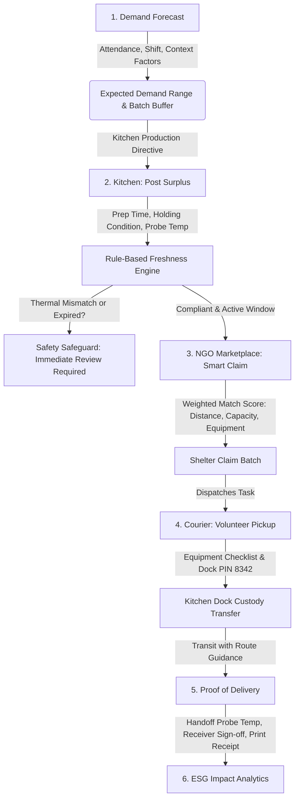

# 🍲 NourishRelief

**Smart India Hackathon 2026**  
**Theme**: Agriculture and Food Tech  
**Problem Statement**: “AI-Powered Smart Food Waste Reduction and Sustainable Redistribution Ecosystem for Institutional Kitchens and Food Processing Units”

[](https://nextjs.org/)
[](https://www.typescriptlang.org/)
[](https://tailwindcss.com/)
[](https://playwright.dev/)
[](https://www.fda.gov/food/hazard-analysis-critical-control-point-haccp)

---

## 📌 Executive Summary

**NourishRelief** is a working operational web platform and hackathon prototype designed for institutional kitchens (such as college hostels, hospital canteens, corporate cafeterias, and food processing units) and recipient charity shelters. 

Rather than treating surplus food solely as an afterthought once it has already cooled or spoiled, the platform bridges the gap between **pre-cooking planning**, **on-site food safety evaluation**, and **verified volunteer handoff**:

1. **Before Cooking — Demand & Surplus Forecasting**: Kitchen managers input anticipated attendance, meal shift (breakfast, lunch, dinner), day of the week, and local context factors (festivals, public holidays, rain, recent trends). The forecast engine computes expected demand with uncertainty bounds (Min, Most Likely, Max) and recommends a planned batch size with an adjustable safety buffer slider. Kitchen staff can accept the suggestion or manually override production numbers, and inspect historical forecast-versus-actual deviation logs with root-cause explanations.
2. **After Cooking — Kitchen Surplus Posting & Rule-Based Safety Engine**: When surplus portions remain, staff log the batch details (portions, weight in kg, dietary tags, pickup instructions) and run an on-screen **Rule-Based Freshness & Expiry Risk Assessment**. Using the preparation timestamp, elapsed holding duration, holding condition, and a recorded probe thermometer temperature, the engine verifies compliance against standard commercial food-safety holding categories:
   - **Hot Holding**: $>60^\circ\text{C}$
   - **Chilled**: $0 - 4^\circ\text{C}$ (with degraded tolerance up to $8^\circ\text{C}$)
   - **Ambient Room Temp**: $\le 25^\circ\text{C}$
   - **Severe Thermal Mismatch Protection**: If a recorded probe temperature contradicts the selected holding condition (e.g. food marked as Chilled but probed at $64^\circ\text{C}$, or Hot food probed at $15^\circ\text{C}$), the engine immediately collapses the redistribution window to `0h 0m`, assigns `HIGH RISK` and `URGENT` priority, and advises immediate inspection before redistribution.
   - **Expired Window Safeguard**: If elapsed holding time exceeds safe redistribution limits, the system explicitly advises that the redistribution window has expired.
3. **During Redistribution — NGO Matching, Dispatch, & Delivery Verification**:
   - **Multi-Factor Shelter Matching**: Matches the surplus batch against regional shelters using a weighted compatibility formula (distance, recipient capacity, thermal equipment like hot-holding cabinets, and dietary tags).
   - **Volunteer Courier Dispatch**: Provides courier route guidance with waypoints and estimated transit time, an equipment checklist (thermal bags, sanitized crates, probe thermometer), and a 4-digit loading dock PIN (`8342`) for custody transfer.
   - **Proof of Delivery & Cold-Chain Check**: Logs destination handoff probe temperature, records receiver credentials, displays an electronic signature badge, enables printable receipts, and captures donor ratings.
   - **ESG & Environmental Telemetry**: Aggregates rescued meals, kilograms of food diverted from landfills, and estimated CO₂ greenhouse emissions avoided ($2.0\text{ kg CO}_2\text{e per kg food diverted}$).

---

## 🚀 Lifecycle Workflow Architecture



---

## 🌟 What the Platform Really Does (Module by Module)

### 1. 📊 Demand & Surplus Forecast (`/forecast`)
- **Deterministic Forecast Calculation**:
  - Base demand calculated from expected attendance, meal factor (Breakfast: 0.72, Lunch: 1.05, Dinner: 0.98), and day-of-week historical weight (Monday through Sunday coefficients).
  - Contextual modifiers applied transparently with individual impact portion calculations:
    - *Festival / Special Event*: $+12\%$ attendance surge
    - *Public Holiday*: $-15\%$ attendance reduction
    - *Inclement Weather (Rain)*: $-5\%$ walk-in dip
    - *Recent 3-Week Participation Trend*: $+4\%$ participation growth
- **Uncertainty Range**: Displays Min ($\text{Most Likely} \times 0.94$), Most Likely, and Max ($\text{Most Likely} \times 1.06$) meal demand predictions.
- **Production Guidance & Buffer Control**: Interactive slider adjusts safety buffer percentage ($0\% - 25\%$, default $10\%$) to compute suggested kitchen production batches.
- **Kitchen Manager Manual Override**: Allows kitchen operators to type custom planned portions and toggle between manager override and system recommendation.
- **Operational Calibration Logs**: A table of historical shift logs comparing predicted demand against actual consumption with operational explanations (e.g. localized thunderstorm attendance dips).

### 2. 🧪 Rule-Based Freshness & Expiry Risk Assessment (`/restaurant/post`)
- **Inputs**: Prepared food title, preparation timestamp (e.g. `15:15`), holding condition, and recorded probe thermometer temperature ($^\circ\text{C}$).
- **Holding Temperature Categories**:
  - *Hot Holding*: Target $\ge 60^\circ\text{C}$ (5.0h safe baseline, max safe cap 5.0h)
  - *Chilled*: Target $0 - 4^\circ\text{C}$ (24.0h safe baseline); degraded holding $4 - 8^\circ\text{C}$ (12.0h safe baseline); severe mismatch $> 15^\circ\text{C}$
  - *Ambient*: Target $\le 25^\circ\text{C}$ (4.0h safe baseline); severe mismatch $> 35^\circ\text{C}$
- **Severe Thermal Mismatch Logic**:
  - If food is selected as *Chilled* but recorded at $64^\circ\text{C}$, or *Hot* but recorded at $15^\circ\text{C}$, the window collapses to `0h 0m (Redistribution window collapsed)`, risk tier is set to `HIGH RISK`, priority is set to `URGENT`, and recommendation advises:  
    `Critical thermal mismatch: Recorded probe temperature (...) is incompatible with (...). Redistribution window collapsed; immediate inspection recommended before redistribution.`
- **Expired Window Logic**:
  - If elapsed time exceeds remaining safe shelf-life without thermal breach, risk tier is set to `HIGH RISK`, priority is set to `URGENT`, and recommendation states:  
    `Redistribution window has expired. Immediate review is recommended before redistribution.`
- **Statutory Notice**: Includes standard food-safety disclaimer:  
  *“AI-assisted redistribution risk assessment. This does not replace statutory food-safety procedures.”*

### 3. 🤝 NGO Shelter Compatibility & Claiming Hub (`/ngo/claim`)
- **Active Surplus Summary**: Shows donor name (`MoFPI Pilot Kitchen 01`), donor rating ($4.9\star$), portions, weight in kg, holding condition, and dietary tags (Vegetarian, Halal Certified, Nut-Free).
- **Multi-Factor Weighted Match Engine**:
  - $\text{Match Score} = (0.35 \times \text{Distance}) + (0.25 \times \text{Capacity}) + (0.25 \times \text{Equipment Compatibility}) + (0.15 \times \text{Urgency})$
  - Awards bonus compatibility points if the recipient shelter possesses commercial hot-holding warming cabinets for hot food.
- **Claim Controls**: Allows claiming full batch or partial portions, selecting volunteer dispatch vs. self-pickup, and verifying food-safety certification.

### 4. 🚴 Courier Logistics & Loading Dock Pickup (`/volunteer/pickup`)
- **Task Overview**: Displays task code (`NR-4821`), donor loading dock address, recipient facility, and estimated transit duration (19 mins, 5.8 km).
- **Route Guidance with Waypoints**: Identifies arterial corridors, avoids known congestion bottlenecks, and provides waypoint milestones from origin dock to receiving bay.
- **Pre-Trip Checklist**: Interactive checkboxes for:
  - Thermal delivery bags ready
  - Sanitized transport crates equipped
  - Calibrated probe thermometer ready ($>60^\circ\text{C}$ check)
- **Handoff Security**: 4-digit PIN verification input (`8342`) to authenticate custody transfer at the donor loading dock before departure.

### 5. ✍️ Delivery Summary & Proof of Delivery (`/volunteer/summary`)
- **Handoff Temperature Log**: Displays arrival probe thermometer reading ($64.2^\circ\text{C}$) confirming thermal integrity throughout transit.
- **Custody Sign-off**: Displays receiver name, job title (`Sunita Sharma, Rasoi & Intake Manager`), delivery timestamp, and recipient electronic signature badge.
- **Delivery Attachments**: Photo load verification badge and container count.
- **Printable Receipt & Rating**: Printable electronic transfer receipt via `window.print()` and an interactive 5-star donor rating widget.

### 6. 📈 ESG Sustainability & Impact Analytics (`/impact`)
- **Core Telemetry Metrics**:
  - *Food Saved (kg)*: Diverted from landfill decomposition
  - *Meals Delivered*: Distributed to community kitchens and shelters
  - *Estimated CO₂ Offset*: Calculated as $\text{Food Saved (kg)} \times 2.0\text{ kg CO}_2\text{e}$
  - *Deliveries Count*: Number of verified completed missions
- **Timeframe Filtering**: Toggle between Cumulative Year-to-Date metrics and Current Month operational telemetry.
- **Carbon Factor Configuration**: Reference to standard environmental conversion multipliers.

---

## 💾 State Persistence & Demo Resilience

NourishRelief is architected with dual persistence for hackathon reliability:
- **Zero-Config Local Demo Persistence**: All platform mutations (updating forecasts, posting donations, claiming batches, updating checklist items, completing handoffs, and recording ratings) are managed via React Context (`PlatformStoreProvider`) and automatically persisted to `localStorage` under versioned keys.
- **Hard-Reload Survival**: A user or judge can refresh any page in the lifecycle (`/forecast` $\rightarrow$ `/restaurant/post` $\rightarrow$ `/ngo/claim` $\rightarrow$ `/volunteer/pickup` $\rightarrow$ `/volunteer/summary` $\rightarrow$ `/impact`) without losing state or resetting to empty values.
- **One-Click Reset Demo Button**: A dedicated **Reset Demo** button in the top right corner clears custom mutations and restores the platform to its clean initial baseline.
- **PostgreSQL / Supabase Schema**: An exportable SQL schema is provided in [`supabase/schema.sql`](supabase/schema.sql) with tables for `donations`, `claims`, `volunteer_tasks`, and `delivery_proofs`.

---

## 🛠️ Technology Stack

| Component | Implementation |
|---|---|
| **Framework** | [Next.js 14.2](https://nextjs.org/) (App Router, Static Generation & Client Hydration) |
| **Language** | [TypeScript 5.6](https://www.typescriptlang.org/) (Strict Mode) |
| **Styling** | [Tailwind CSS 3.4](https://tailwindcss.com/) with custom typography & dark/light theme tokens |
| **State & Storage** | React Context API + versioned `localStorage` simulation + Supabase client integration |
| **Testing** | [Playwright 1.63](https://playwright.dev/) End-to-End & Unit Test Suite |
| **Brand Identity** | Custom SVG vector favicon & PNG app icon matching navigation emblem |

---

## 🧪 Automated Testing Suite

All features, safety calculations, UI layouts, and persistence mechanisms are covered by an automated test suite executed via Playwright:

```bash
# Run the complete test suite
npx playwright test
```

### Verified Scenarios (16 Passed):
1. **Freshness Engine Unit Tests (`tests/freshness.spec.ts`)**:
   - Case 1: Chilled holding ($0-4^\circ\text{C}$) with $64^\circ\text{C}$ probe temp (verifies thermal mismatch collapse).
   - Case 2: Chilled holding with compliant $3.5^\circ\text{C}$ probe temp.
   - Case 3: Chilled holding with minor drift ($6.5^\circ\text{C}$) verifying accelerated degradation.
   - Case 4: Hot holding ($>60^\circ\text{C}$) with compliant $65^\circ\text{C}$ probe temp.
   - Case 5: Hot holding with cold probe temp $15^\circ\text{C}$ (thermal mismatch).
   - Case 6: Ambient holding with compliant $22^\circ\text{C}$ probe temp.
   - Case 7: Ambient holding with hot probe temp $64^\circ\text{C}$ (thermal mismatch).
   - Case 8: Hot holding with compliant $64^\circ\text{C}$ probe temp but expired holding window ($8\text{h}$ elapsed), verifying the exact warning: `"Redistribution window has expired. Immediate review is recommended before redistribution."`
2. **Freshness UI Verification**: Tests that UI correctly displays "Within Target Range" vs "Severe Thermal Mismatch", and updates remaining hours dynamically.
3. **Complete End-to-End Lifecycle Flow (`tests/nourishrelief.spec.ts`)**:
   - Traverses: Home $\rightarrow$ Forecast $\rightarrow$ Kitchen Post $\rightarrow$ NGO Claim $\rightarrow$ Courier Transit $\rightarrow$ Delivery Summary $\rightarrow$ Impact ESG.
4. **Mobile Responsiveness**: Confirms zero horizontal overflow across all 7 routes on 375px mobile viewports.
5. **Theme Switching**: Verifies dark mode / light mode toggle and stylesheet application.
6. **State Persistence Across Page Reloads (`tests/persistence-reload.spec.ts`)**: Confirms multi-role state survives browser refresh.
7. **Reset Demo Verification**: Verifies the top-right Reset Demo button restores initial baseline and routes to Home.
8. **Browser Tab Icon**: Validates that `<link rel="icon">` references the brand emblem and that `/icon.svg` & `/favicon.ico` return HTTP 200.

---

## ⚡ Quick Start & Local Development

### Prerequisites
- Node.js (v18.17.0 or newer)
- npm (v9.0 or newer)

### Installation & Execution

```bash
# 1. Clone repository
git clone https://github.com/v-abhiramreddy/NOURISH_RELIEF_SIH26.git
cd NOURISH_RELIEF_SIH26

# 2. Install dependencies
npm install

# 3. Start local development server
npm run dev
```

Visit [http://localhost:3000](http://localhost:3000) in your browser.

### Production Build

```bash
# Build optimized production bundle
npm run build

# Start production server
npm run start
```

---

## 👥 Hackathon Team & Acknowledgements

- **Team**: NourishRelief
- **Event**: Smart India Hackathon (SIH) 2026
- **Theme**: Agriculture and Food Tech
- **Problem Statement**: “AI-Powered Smart Food Waste Reduction and Sustainable Redistribution Ecosystem for Institutional Kitchens and Food Processing Units”
- **Compliance Standards**: Formulated in alignment with FSSAI statutory food safety standards and HACCP commercial holding principles.

---

## 📄 License

This project is licensed under the MIT License.
