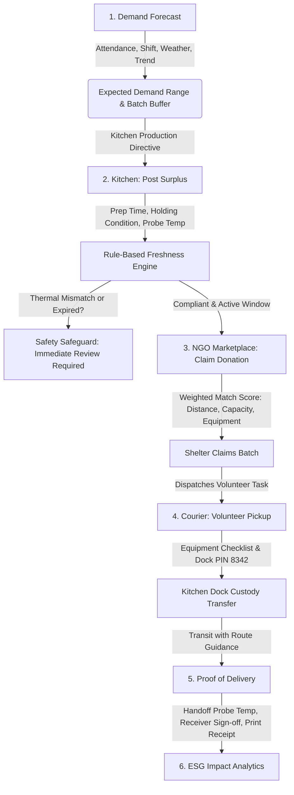

# 🍲 NourishRelief

**Smart India Hackathon 2026**  
**SIH Problem Statement ID**: SIH26234  
**Theme**: Agriculture and Food Tech  
**Problem Statement**: "AI-Powered Smart Food Waste Reduction and Sustainable Redistribution Ecosystem for Institutional Kitchens and Food Processing Units"

[](https://nextjs.org/)
[](https://www.typescriptlang.org/)
[](https://tailwindcss.com/)
[](https://playwright.dev/)
[](https://www.fda.gov/food/hazard-analysis-critical-control-point-haccp)
[](https://supabase.com/)

---

## 📌 Executive Summary

**NourishRelief** is a working operational web platform and hackathon prototype designed for institutional kitchens (college hostels, hospital canteens, corporate cafeterias, food processing units) and recipient NGO shelters.

The platform addresses food waste at three distinct intervention points:

1. **Before Cooking — Demand & Surplus Forecasting**: Kitchen managers use an attendance-driven demand forecasting engine that computes expected meal demand with transparent uncertainty bounds (Min, Most Likely, Max), an adjustable safety buffer slider, and an explainable AI breakdown modal detailing every applied modifier. Managers can accept the system recommendation or apply a manual production override with deviation tracking.

2. **After Cooking — Kitchen Surplus Posting & Rule-Based Safety Engine**: When surplus remains, staff log the batch and run a **Rule-Based Freshness & Expiry Risk Assessment** using preparation time, elapsed holding duration, holding condition, and recorded probe thermometer temperature. The engine enforces HACCP-aligned thermal safety categories and collapses the redistribution window immediately on thermal mismatch or expiry.

3. **During Redistribution — NGO Matching, Dispatch & Delivery Verification**: A weighted multi-factor shelter compatibility engine matches surplus to the best-fit NGO. A volunteer courier receives a task with route guidance, equipment checklist, and 4-digit dock PIN for custody transfer. Proof of delivery is logged with handoff probe temperature, receiver credentials, and an ESG impact summary.

---

## 🚀 Lifecycle Workflow Architecture


```mermaid
graph TD
    A[1. Demand Forecast] -->|Attendance, Shift, Weather, Trend| B(Expected Demand Range & Batch Buffer)
    B -->|Kitchen Production Directive| C[2. Kitchen: Post Surplus]
    C -->|Prep Time, Holding Condition, Probe Temp| D[Rule-Based Freshness Engine]
    D -->|Thermal Mismatch or Expired?| E[Safety Safeguard: Immediate Review Required]
    D -->|Compliant & Active Window| F[3. NGO Marketplace: Claim Donation]
    F -->|Weighted Match Score: Distance, Capacity, Equipment| G[Shelter Claims Batch]
    G -->|Dispatches Volunteer Task| H[4. Courier: Volunteer Pickup]
    H -->|Equipment Checklist & Dock PIN 8342| I[Kitchen Dock Custody Transfer]
    I -->|Transit with Route Guidance| J[5. Proof of Delivery]
    J -->|Handoff Probe Temp, Receiver Sign-off, Print Receipt| K[6. ESG Impact Analytics]
```

---

## 🌟 Platform Architecture

### Authentication & Role-Based Access Control (RBAC)

NourishRelief supports two fully distinct operational modes:

#### Demo Mode (Evaluator Access — No Credentials Required)
- Accessible from the login page via **"Continue to Demo Mode"** without any credentials.
- A unified `/dashboard` displays all four operational roles in a single scrollable demo view.
- A **DemoRoleSwitcher** header provides tabbed role navigation (Kitchen → NGO → Courier → Admin) and a **Reset Demo** button.
- All workflow state persists across page reloads via `localStorage`.

#### Sign-In / Real Mode (Authenticated Access)
- Users sign in with email + password + role selection (Kitchen Manager, NGO Coordinator, Volunteer Logistics Courier, Admin).
- `middleware.ts` enforces server-side route protection redirecting unauthenticated users to `/login`.
- A `RoleGuard` client component blocks cross-role page access and displays an access-denied screen.
- **Supabase Auth** integration handles JWT-based session management. Unprovisioned credentials display a safe informational notice.

#### Application Roles

| Role | Accessible Routes | Workspace |
|---|---|---|
| **Kitchen Manager** | `/forecast`, `/restaurant/post`, `/dashboard/kitchen` | Demand Forecasting & Surplus Posting |
| **NGO Coordinator** | `/ngo/claim`, `/dashboard/ngo` | Shelter Claim & Compatibility Hub |
| **Volunteer Logistics Courier** | `/volunteer/pickup`, `/volunteer/summary`, `/dashboard/courier` | Volunteer Logistics & Redistribution Workspace |
| **Admin (Read-Only)** | All routes (read-only) | ESG Impact & Audit Console |
| **Platform Manager** | All routes + override controls | Governance & Emergency Override Console |

---

## 🌟 What the Platform Does (Module by Module)

### 1. 📊 Demand & Surplus Forecast (`/forecast`)

- **Deterministic Forecast Calculation**:
  - Base demand calculated from expected attendance, meal factor (Breakfast: 0.72, Lunch: 1.05, Dinner: 0.98), and day-of-week historical weights.
  - Contextual modifiers applied transparently:
    - *Inclement Weather (Rain)*: −5% walk-in dip
    - *Recent 3-Week Participation Trend*: +4% growth applied from historical data
- **Uncertainty Range**: Displays Min (Most Likely × 0.94), Most Likely, and Max (Most Likely × 1.06) meal demand predictions.
- **Production Guidance & Buffer Control**: Interactive slider adjusts safety buffer (0%–25%, default 10%) to compute suggested batch sizes.
- **Kitchen Manager Manual Override**: Custom portions input with toggle between manager override and system recommendation.
- **Operational Calibration Logs**: Historical shift deviation table comparing predicted demand vs. actual consumption with root-cause explanations.
- **Explainable AI Forecast Modal**: A dedicated **"Explain Forecast"** button opens a breakdown popup disclosing:
  - Attendance, meal shift, weather, and 3-week trend as **Current Factors** with individual impact on the demand calculation.
  - Honest disclosure: *"Demo Synthetic Baseline — forecast computed from synthetic institutional attendance records."*
  - Forecast invariant validation: Min ≤ Most Likely ≤ Max is enforced at all times.

### 2. 🧪 Rule-Based Freshness & Expiry Risk Assessment (`/restaurant/post`)

- **Inputs**: Food title, preparation timestamp, holding condition, and recorded probe thermometer temperature (°C).
- **Holding Temperature Categories (HACCP-aligned)**:
  - *Hot Holding*: Target ≥ 60°C — 5.0h safe baseline
  - *Chilled*: Target 0–4°C — 24.0h baseline; degraded 4–8°C — 12.0h baseline
  - *Ambient*: Target ≤ 25°C — 4.0h baseline
- **Severe Thermal Mismatch Logic**: If probe temperature contradicts the selected holding condition (e.g. Chilled food probed at 64°C, or Hot food probed at 15°C), the redistribution window collapses to `0h 0m`, risk tier is set to `HIGH RISK`, priority is set to `URGENT`, and recommendation states: *"Critical thermal mismatch: Redistribution window collapsed; immediate inspection recommended before redistribution."*
- **Expired Window Safeguard**: If elapsed holding time exceeds safe redistribution limits, risk tier is `HIGH RISK`, priority `URGENT`, and system advises: *"Redistribution window has expired. Immediate review is recommended before redistribution."*
- **Terminology Explanation Tooltips**: Five info icons alongside technical field labels reveal plain-language explanations on hover (desktop) or tap (mobile).
- **Statutory Notice**: *"AI-assisted redistribution risk assessment. This does not replace statutory food-safety procedures."*
- **Portions Stepper & Slider**: Interactive stepper (+ / −) and range slider for adjusting planned portions.

### 3. 🤝 NGO Shelter Compatibility & Claiming Hub (`/ngo/claim`)

- **Active Surplus Summary**: Displays donor name, portions, weight in kg, holding condition, and dietary tags (Vegetarian, Halal Certified, Nut-Free).
- **Multi-Factor Weighted Match Engine**:
  - Match Score = (0.35 × Distance) + (0.25 × Capacity) + (0.25 × Equipment Compatibility) + (0.15 × Urgency)
  - Bonus compatibility points awarded if recipient possesses hot-holding warming cabinets.
- **Recommended Recipient (Weighted Match)**: The top-scored shelter is visually highlighted with match score badge and natural-language match rationale.
- **Scored Match Transparency Modal**: A dedicated **"ⓘ How is this match scored?"** button opens a transparent scoring breakdown disclosing:
  - Exact individual factor sub-scores: Distance (35%), Capacity (25%), Fit (25%), Urgency (15%) dynamically calculated for the selected NGO.
  - Transparent deterministic formula disclosure for evaluators.
- **Claim Controls**: Full-batch or partial-portion claim, volunteer dispatch vs. self-pickup selection, and food-safety certification acknowledgement.

### 4. 🚴 Courier Logistics & Loading Dock Pickup (`/volunteer/pickup`)

- **Task Overview**: Task code (`NR-4821`), donor loading dock address, recipient facility, and estimated transit duration (19 mins, 5.8 km).
- **AI Optimized Route Guidance**: Waypoints identifying arterial corridors and avoiding known congestion bottlenecks.
- **Demo Route Badge**: In Demo Mode, the delivery section shows a **Demo Route** badge in yellow with a blink effect, clearly distinguishing it from a live operational dispatch.
- **Pre-Trip Checklist**: Insulated thermal bags, sanitized transport crates, and calibrated temperature probe — each as interactive checkboxes.
- **Handoff Security**: 4-digit PIN verification input (`8342`) to authenticate custody transfer at the loading dock.

### 5. ✍️ Delivery Summary & Proof of Delivery (`/volunteer/summary`)

- **Handoff Temperature Log**: Arrival probe thermometer reading (64.2°C) confirming thermal integrity throughout transit.
- **Custody Sign-off**: Receiver name (`Sunita Sharma, Rasoi & Intake Manager`), delivery timestamp, and electronic signature badge.
- **Printable Receipt**: Electronic transfer receipt via `window.print()`.
- **Donor Rating Widget**: Interactive 5-star rating.

### 6. 📈 ESG Sustainability & Impact Analytics (`/impact`)

- **Core Telemetry Metrics**:
  - Food Saved (kg) — diverted from landfill decomposition
  - Meals Delivered — distributed to community kitchens and shelters
  - Estimated CO₂ Offset — calculated as `Food Saved (kg) × 2.0 kg CO₂e`
  - Deliveries Count — verified completed missions
- **Timeframe Filtering**: Toggle between Cumulative Year-to-Date and Current Month telemetry.
- **NourishRelief ESG Summary Clipboard Export**: Copy ESG summary to clipboard for sharing.

### 7. 🖥️ Role-Based Dashboards

Each authenticated role has a dedicated dashboard workspace:

| Dashboard Route | Role | Description |
|---|---|---|
| `/dashboard/kitchen` | Kitchen Manager | Demand forecast snapshot, surplus status, donation lifecycle |
| `/dashboard/ngo` | NGO Coordinator | Surplus discovery, weighted match score, intake monitoring |
| `/dashboard/courier` | Volunteer Courier | Assigned pickup task, route waypoints, transit actions |
| `/dashboard/admin` | Admin | Platform-wide ESG impact, live donation lifecycle, internal redistribution compliance auditing |

### 8. 🛡️ Platform Manager Governance Console

A **Platform Manager** role operates a dedicated governance console within the Admin dashboard with elevated capabilities:

- **Safe Override Mode Toggle**: Enables emergency workflow interventions with a mandatory acknowledgement gate.
- **Lifecycle State Override**: Force-advances or resets donation lifecycle state (e.g. `claimed → in_transit`), with confirmation dialog and audit trail logging.
- **Courier Reassignment**: Reassigns an active delivery to a different courier with full confirmation and audit trail.
- **Admin Role is Read-Only**: The standard Admin role explicitly cannot perform Platform Manager mutations — enforced by a `isPlatformManager` flag check.

---

## 💾 State Persistence & Architecture

- **Zero-Config Local Demo Persistence**: All platform mutations (forecasts, donation posts, NGO claims, checklist completions, delivery proofs, ratings) are managed via React Context (`PlatformStoreProvider`) and auto-persisted to `localStorage` under versioned keys.
- **Hard-Reload Survival**: A full browser refresh at any lifecycle stage (`/forecast` → `/restaurant/post` → `/ngo/claim` → `/volunteer/pickup` → `/volunteer/summary` → `/impact`) retains all state.
- **Sign-In Mode Fresh Cycle**: Signing out and back in resets the *active* operational donation to `null` while preserving delivery history from prior sessions.
- **One-Click Reset Demo**: The Reset Demo button in the header clears all mutations and restores the platform to its clean initial baseline.
- **Supabase / PostgreSQL Schema**: An exportable SQL schema is provided in [`supabase/schema.sql`](supabase/schema.sql) covering `donations`, `claims`, `volunteer_tasks`, and `delivery_proofs` tables.

---

## 🛠️ Technology Stack

| Component | Implementation |
|---|---|
| **Framework** | [Next.js 14.2](https://nextjs.org/) (App Router, Static Generation & Client Hydration) |
| **Language** | [TypeScript 5.6](https://www.typescriptlang.org/) (Strict Mode) |
| **Styling** | [Tailwind CSS 3.4](https://tailwindcss.com/) with custom typography, dark/light theme tokens, and Indian Flag Tricolor brand palette |
| **Authentication** | Supabase Auth (JWT sessions) + local Demo Mode bypass |
| **State & Storage** | React Context API + versioned `localStorage` + Supabase client integration |
| **Middleware & RBAC** | Next.js `middleware.ts` (server-side route protection) + `RoleGuard` (client-side access boundary) |
| **Forecast Engine** | Deterministic rule-based demand calculation in `src/lib/ml-forecast.ts` |
| **Freshness Engine** | HACCP-aligned thermal safety logic in `src/lib/freshness-engine.ts` |
| **NGO Matcher** | Multi-factor weighted scoring in `src/lib/ngo-matcher.ts` |
| **Route Optimizer** | Volunteer waypoint routing in `src/lib/route-optimizer.ts` |
| **Testing** | [Playwright 1.63](https://playwright.dev/) — 81 E2E & unit tests across 14 test files |
| **Brand Identity** | Custom SVG vector favicon & PNG app icon matching navigation emblem |

---

## 🧪 Automated Testing Suite

All features, safety calculations, UI layouts, RBAC boundaries, and persistence mechanisms are covered by an automated Playwright test suite:

```bash
# Run the complete test suite (81 tests)
npx playwright test
```

### Test Files & Coverage

| Test File | Tests | Coverage |
|---|---|---|
| `tests/auth-rbac.spec.ts` | 10 | Login page, Demo Mode bypass, DemoRoleSwitcher, RBAC boundaries (NGO/Courier/Admin), real-mode navigation |
| `tests/dashboards.spec.ts` | 14 | All 4 role dashboards, unified demo dashboard, RBAC authorization, mobile responsiveness, kitchen publish & NGO claim workflows |
| `tests/forecast-explanation.spec.ts` | 13 | Explain Forecast modal — visibility, content, factor display, weather/attendance/shift interactions, mobile layout |
| `tests/forecast.spec.ts` | 7 | Forecast engine invariants, transparency labels, surplus risk assessment, pluggable data provider, feedback loop |
| `tests/freshness-tooltips.spec.ts` | 3 | Tooltip hover/tap behavior (desktop, mobile, Sign-In Mode) |
| `tests/freshness.spec.ts` | 9 | All 8 freshness engine audit cases (thermal mismatch, expired window, HACCP compliance) + UI consistency |
| `tests/judge-workflow-modal.spec.ts` | 3 | Sign In page View Judge Workflow button & modal, exact numbered steps, Recommended Demo Path, modal dismissal |
| `tests/kitchen-portions.spec.ts` | 2 | Portions stepper & slider (Demo + Sign-In Mode), top Sign Out button |
| `tests/mobile-layout-and-brand.spec.ts` | 3 | Brand tricolor colors, mobile duplicate section check, desktop column visibility |
| `tests/nourishrelief.spec.ts` | 7 | Complete SIH E2E lifecycle flow, mobile responsiveness, dark mode, mouse-wheel scroll, header navigation, favicon |
| `tests/persistence-reload.spec.ts` | 1 | Full workflow state survival across reloads (Forecast → Kitchen → NGO → Courier → Proof → Impact) |
| `tests/photo-upload.spec.ts` | 2 | Food photo replace/upload from computer & mobile, canvas compression, preview, reset, Demo & Sign-In Mode persistence |
| `tests/platform-manager-override.spec.ts` | 5 | Admin read-only enforcement, Platform Manager governance toggle, lifecycle override, courier reassignment, Demo Mode override |
| `tests/signin-fresh-cycle-with-history.spec.ts` | 3 | Fresh Sign-In cycle with history preservation, cross-role food posting, clean empty state on new session |

**Total: 81 tests passing (0 failures)**

---

## ⚡ Quick Start & Local Development

### Prerequisites
- Node.js (v18.17.0 or newer)
- npm (v9.0 or newer)

### Installation & Execution

```bash
# 1. Clone repository
git clone https://github.com/v-abhiramreddy/NOURISH_RELIEF_SIH26.git
cd NOURISH_RELIEF_SIH26

# 2. Install dependencies
npm install

# 3. Start local development server
npm run dev
```

Visit [http://localhost:3000](http://localhost:3000) in your browser.

The login page offers **"Continue to Demo Mode"** — no credentials required for full platform evaluation.

### Production Build

```bash
# Build optimized production bundle (17 static routes)
npm run build

# Start production server
npm run start
```

### Running Tests

```bash
# Full Playwright test suite
npx playwright test

# Specific test file
npx playwright test tests/freshness.spec.ts

# TypeScript type check
npx tsc --noEmit
```

---

## 📁 Project Structure

```
src/
├── app/                    # Next.js App Router pages
│   ├── dashboard/          # Role dashboards (kitchen, ngo, courier, admin)
│   ├── forecast/           # Demand forecasting page
│   ├── restaurant/post/    # Kitchen surplus posting & freshness engine
│   ├── ngo/claim/          # NGO shelter matching & claim hub
│   ├── volunteer/
│   │   ├── pickup/         # Courier transit & pickup task
│   │   └── summary/        # Proof of delivery
│   ├── impact/             # ESG analytics dashboard
│   ├── login/              # Authentication page (Demo + Real Mode)
│   └── overview/           # Platform overview page
├── components/
│   ├── DemoRoleSwitcher.tsx  # Unified demo header & role navigation
│   └── RoleDashboardNav.tsx  # Authenticated role navbar
├── lib/
│   ├── auth/               # Auth context, Supabase session management
│   ├── services/           # Pluggable data provider (local + Supabase)
│   ├── freshness-engine.ts # HACCP thermal safety logic
│   ├── ml-forecast.ts      # Deterministic demand forecast engine
│   ├── ngo-matcher.ts      # Weighted shelter compatibility scoring
│   ├── route-optimizer.ts  # Volunteer route waypoint optimizer
│   ├── impact-calculator.ts# ESG metrics computation
│   └── store.tsx           # Platform-wide React Context state store
├── middleware.ts            # Next.js server-side route protection
└── types/                  # Shared TypeScript type definitions

supabase/
└── schema.sql              # PostgreSQL schema for production deployment

tests/                      # 14 Playwright test files (81 tests)
```

---

## 👥 Hackathon Team & Acknowledgements

- **Team**: NourishRelief
- **Event**: Smart India Hackathon (SIH) 2026
- **Problem Statement ID**: SIH26234
- **Theme**: Agriculture and Food Tech
- **Problem Statement**: "AI-Powered Smart Food Waste Reduction and Sustainable Redistribution Ecosystem for Institutional Kitchens and Food Processing Units"
- **Compliance Standards**: Formulated in alignment with FSSAI statutory food safety standards and HACCP commercial food holding principles.

---

## 📄 License

This project is licensed under the MIT License.
